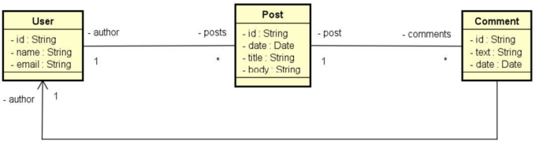
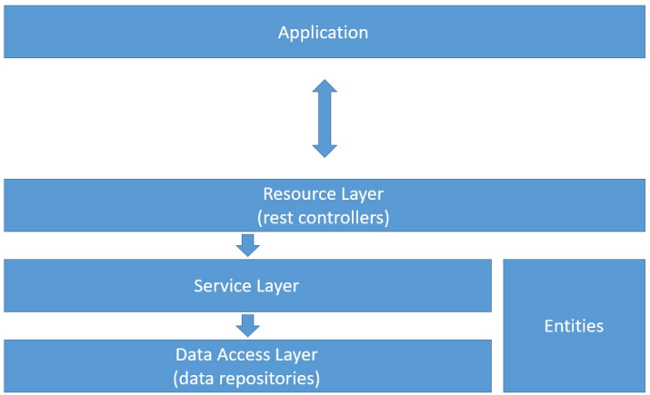

# Project: Spring Boot and MongoDB

The project was built using Java 17.

This project is part of the Java course on Udemy: [JAVA OOP](https://www.udemy.com/course/java-curso-completo/?couponCode=MT24125)

- **Objectives**  
  - Understand the main differences between document-oriented and relational paradigms  
  - Implement CRUD operations  
  - Reflect on design decisions for a document-oriented database  
  - Implement associations between objects:  
    - Nested objects  
    - References  
  - Perform queries using Spring Data and MongoRepository  

- **Model**

- **Logical Layers**

